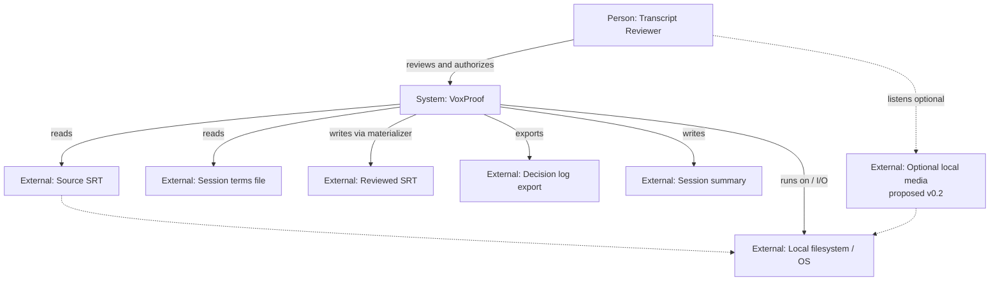
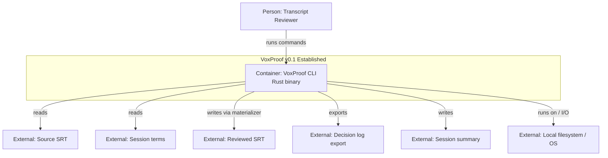
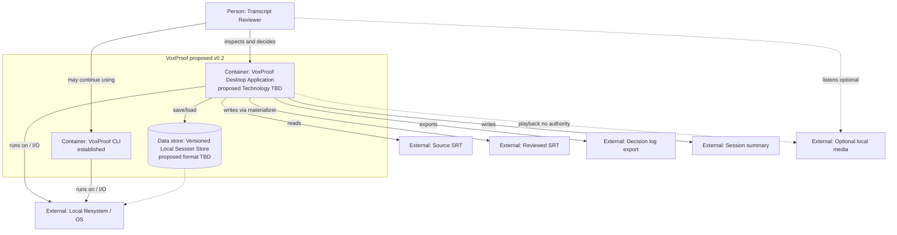
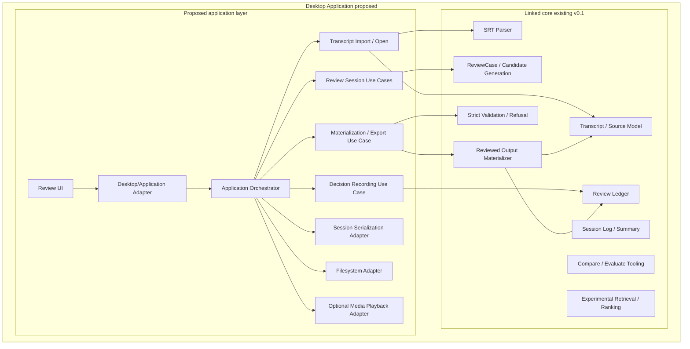

Status: draft / proposed

Owns: Proposed v0.2 C4 architecture views, trust-boundary analysis, and open architectural decisions pending Ezra approval.
Does not own: v0.1 product scope, v0.1 release status, accepted Material Decisions, implementation tasks, or field-level schemas.

Last reviewed against code/evidence: repository HEAD `3072a7f`; v0.1 established by MD-008; local annotated tag `v0.1.0` at same commit.

# VoxProof v0.2 C4 Architecture Draft

## Status

**Status: draft / proposed**

This document does not establish v0.2 scope or approve a new architecture. Established v0.1 semantics remain authoritative. Any durable v0.2 architecture choice requires Ezra approval through the Material Decision process (`governance/material-decisions.md`).

## Purpose

Provide the first v0.2 planning artifact: a C4-style architecture description that separates:

1. the **established v0.1** architecture and ownership boundaries as implemented today;
2. a **proposed v0.2** product architecture for a conditional thin desktop review surface;
3. **unresolved architectural decisions** that still require Ezra approval before implementation.

This draft is synchronized with `architecture/v0.2-c4.dsl` for Structurizr rendering when a renderer is available.

## Reading conventions

| Label | Meaning |
| --- | --- |
| **Established v0.1** | Verified in repository code and/or accepted Material Decisions at v0.1 tag target |
| **Proposed v0.2** | Planning direction only; not approved for implementation |
| **TBD boundary** | Responsibility boundary recognized but technology or shape not decided |
| **External environment** | Files, OS services, or local artifacts — not active software owned by VoxProof |

**C4 level rule used in this draft:** a Level 2 container is an independently running or deployable executable, process, or data store. A linked library crate is a Level 3 build/component boundary inside an executable, not a separate container.

Diagrams use Mermaid `flowchart` syntax for broad renderer compatibility. The Structurizr DSL (`architecture/v0.2-c4.dsl`) remains the machine-readable C4 model.

## Established architectural invariants

Derived from canonical repository documents (`architecture/overview.md`, `architecture/data-contract.md`, MD-001 through MD-008, `product/correction-system-boundaries.md`). These are **established** and must survive v0.2 unless superseded by a new accepted Material Decision.

| Invariant | Established meaning | Canonical source |
| --- | --- | --- |
| Local-first operation | Review, evidence, decisions, and outputs remain on the user's machine; no required cloud service | `architecture/overview.md`; MD-007 D7 |
| Source transcript traceability | Parsed source retains cue index, timing, and text anchors traceable to input SRT | MD-001; `src/transcript.rs`, `src/anchor.rs` |
| Immutable source semantics | Source transcript is not silently rewritten; reviewed output is derived | MD-003; `architecture/overview.md` |
| Explicit human correction authority | Only explicit human decisions (or later explicitly authorized forms) may authorize text change | MD-002; MD-003 |
| Reviewed output is derived | Reviewed SRT = source + accepted applicable decisions via canonical materializer | MD-003; `src/reviewed_output.rs` |
| Analyzers propose, not authorize | Detectors produce `CandidateSpan` / evidence; they do not edit canonical transcript state | `architecture/overview.md`; `.cursor/rules/20-rust-core-boundaries.mdc` |
| UI does not own domain truth | Presentation and interaction only; not the owner of canonical decisions or reviewed output | `architecture/overview.md` |
| Deterministic decision semantics | `ReviewLedger` records append-only events; status derived from events | MD-002; `src/review.rs` |
| Fail-closed materialization | Incompatible revision, anchor, overlap, or decision input refuses materialization | MD-003; `src/reviewed_output.rs` |
| Shared correctness semantics | CLI and future product surfaces must reuse the same canonical core correctness and materialization semantics. The shape of a shared application-service layer remains TBD. | MD-003; `architecture/overview.md` |
| Experimental ranking is non-authoritative | Experimental retrieval/ranking cannot directly write authoritative decisions or reviewed SRT | `src/experimental_retrieval.rs`, `src/experimental_ranking.rs`; CLI `review-experiment` |

**Proposed v0.2 constraints** (not yet established) are listed separately in [Proposed constraints](#proposed-constraints) and [Open decisions](#open-decisions).

## Level 1 — System Context



### System Context — explanatory table

| Element | Role | v0.1 today | Notes |
| --- | --- | --- | --- |
| Transcript Reviewer | Human operator | CLI-driven review (`vox-proof review`) | v0.2 may add desktop UI; authority unchanged |
| VoxProof | Main system | CLI executable linking the Rust library | Post-ASR review only; not ASR |
| Source SRT | Input artifact | Required | Immutable semantics |
| Session terms | Input artifact | Required for review path | Provisional v0.1 format (`session-terms.txt`) |
| Reviewed SRT | Output artifact | Produced by `derive_reviewed_srt` | Derived only |
| Decision log | Output artifact | Rendered from `ReviewLedger` | The ReviewLedger events are authoritative. The decision log is a deterministic exported representation. |
| Session summary | Output artifact | `session_summary` module | Descriptive metrics only |
| Local filesystem / OS environment | External environment | Hosts CLI; all I/O | Not a VoxProof container |
| Optional local media | External environment | Not integrated in v0.1 CLI | Proposed v0.2 sensory aid only |

**Explicitly absent:** cloud services, user accounts, telemetry backends, remote model APIs, collaboration servers, ASR providers, automatic correction authority.

## Level 2A — v0.1 Current Containers

Based on verified repository layout: one Rust package (`vox-proof`), one primary product executable. The Rust library crate is a linked build/component boundary, not an independently running C4 container.



### v0.1 container inventory

| Element | C4 level | Technology | Established? | Evidence |
| --- | --- | --- | --- | --- |
| VoxProof CLI | Container | Rust binary (`src/main.rs`) | Yes | Subcommands: default parse, `review`, `compare`, `evaluate`, `review-experiment` |
| Linked Rust library modules | Components inside CLI | Rust library (`src/lib.rs`) | Yes | Linked into CLI; not a separate process |
| Phonetic characterization example | Non-product executable (omitted from product view) | `examples/phonetic_characterization.rs` | Yes (non-product) | Algorithm study only; not review surface |
| Desktop GUI | — | — | **No** | Not present |
| Session store | — | — | **No** | No versioned session store |
| Media playback | — | — | **No** | Not present in v0.1 CLI |

## Level 2B — v0.2 Proposed Containers

Proposed target shape only. Technology choices remain **TBD**. Responsibilities that would live in one desktop process are components of the Desktop Application, not separate containers.



### Proposed container notes

| Level 2 element | Role | Classification |
| --- | --- | --- |
| VoxProof CLI | Existing v0.1 product executable | Established v0.1 |
| VoxProof Desktop Application | Proposed single desktop process/executable containing UI, application orchestration, linked core semantics, adapters | Proposed v0.2; Technology: TBD |
| Versioned Local Session Store | Local persisted session resource (data store), not an active service | Proposed v0.2; Technology and format: TBD |

In-process responsibilities inside the Desktop Application (not Level 2 containers): Review UI, Desktop/Application Adapter, Application Orchestrator, use cases, Session Serialization Adapter, Filesystem Adapter, Optional Media Playback Adapter, and reused linked core components.

Do **not** read this diagram as approval of Tauri, TypeScript, SQLite, a specific GUI framework, macOS-only release, or a specific session serialization format.

## Level 3 — Desktop Application Components

Highest-risk in-process boundary for v0.2 planning: components of the proposed **VoxProof Desktop Application**. Existing v0.1 core semantics appear as linked/in-process components reused by that executable. The Structurizr component view targets this container only.



### Component classification summary

| Component area | Classification | Ownership |
| --- | --- | --- |
| Review UI | Proposed v0.2 | Presentation only; not authoritative |
| Desktop/Application Adapter, Application Orchestrator, use cases | Proposed v0.2 | Application layer; not core domain |
| Session Serialization Adapter | Proposed v0.2 | Infrastructure; not core domain |
| Filesystem / Media Playback Adapters | Proposed v0.2 | Infrastructure; media has no correction authority |
| SRT / transcript / anchors / terms / analysis / detectors / ledger / materializer / validation / session log-summary | Existing v0.1 | Linked core semantics reused in-process |
| Compare / Evaluate Tooling | Existing v0.1 tooling | Not default authoritative product flow |
| Experimental Retrieval / Ranking | Existing v0.1 experimental | Non-authoritative sidecar semantics |

For the established CLI executable, the same linked modules exist today inside `vox-proof` / `src/main.rs` without a separate application orchestrator. That CLI internal component tree is established runtime reality; the Desktop Application component view above is the proposed v0.2 planning surface.

## Critical runtime flows

### Flow A — open and inspect

**v0.1 current path:**

```text
Reviewer → CLI → parser/core validation → ReviewCase/evidence output
```

**v0.2 proposed path:**

```text
Reviewer → Desktop Application → application use case
→ parser/core validation → ReviewCase/evidence presentation
```

No separate application layer exists in v0.1. Nearby transcript context in the CLI is presentation-only.

**Authority:** evidence and cases originate in core detectors; presentation does not mutate source.

### Flow B — authoritative decision (established v0.1)

1. Reviewer expresses intent (`a`/`r`/`d`/`m` in CLI; proposed UI control in v0.2).
2. Product surface validates intent shape and forwards to core ledger recording.
3. `ReviewLedger.record_decision` appends an event bound to `ReviewCase` id and observed `TranscriptRevisionId`.
4. Derived status reflects latest applicable event; UI/CLI transient state is not authoritative.

**Rule:** UI state is not authoritative. Only ledger events are. The decision log file is an export of those events, not an independent authority.

### Flow C — materialize reviewed output (established v0.1)

1. Immutable source transcript (parsed, unmodified).
2. Plus review cases and append-only ledger with accepted applicable `AcceptAlternative` decisions.
3. Canonical core materializer (`derive_reviewed_srt`) applies replacements with overlap and revision checks.
4. Emits reviewed SRT; product surface writes file.

**Rule:** No alternative UI-side output path is permitted. Materialization refusal is fail-closed (MD-003).

### Flow D — proposed session recovery (proposed v0.2)

1. Versioned Local Session Store artifact on local filesystem.
2. Load verifies source identity (`TranscriptRevisionId` / MD-001) matches embedded snapshot.
3. Compatibility validation for schema revision, detector identities, and ledger replay rules.
4. Restores application-facing state and core ledger/events.

**Rule:** incompatible sessions must fail closed; must not invent alternate correction semantics.

### Flow E — optional media playback (proposed v0.2)

1. Local media file on filesystem.
2. Playback adapter inside Desktop Application exposes time-aligned listening to reviewer.
3. Informs human sensory judgment only.

**Rule:** Playback has no correction authority. It cannot write ledger events or reviewed SRT.

## Ownership and trust boundaries

| Boundary | May own | Must not own | Established or proposed | Evidence / canonical source |
| --- | --- | --- | --- | --- |
| Product UI (CLI prompts today; Review UI proposed) | Presentation, navigation, human intent capture, export triggers | Canonical decisions, reviewed SRT text, detector configuration truth | CLI established; GUI proposed | `architecture/overview.md`; MD-002 |
| Application layer (CLI inline today; orchestrator/use cases proposed) | Use-case sequencing, I/O adapters, session lifecycle coordination | Independent correction semantics; alternate materialization | CLI established; desktop split proposed | `src/main.rs`; v0.2 planning only |
| Core domain (linked Rust library modules) | Transcript model, ReviewCase, ledger semantics, materialization, analysis identity | UI concerns; ad hoc file formats without MD | Established v0.1 | MD-001–MD-006; `src/lib.rs` |
| Analyzers / detectors | Bounded evidence, `CandidateSpan`, provenance | Accepted decisions; direct transcript edits | Established v0.1 | MD-004, MD-005; detector modules |
| Decision ledger | Append-only events, decision validation, status derivation | UI-local mutable "current choice" as authority; exported log file as authority | Established v0.1 | MD-002; `ReviewLedger` |
| Materializer | Derived reviewed SRT from source + accepted decisions | Heuristic auto-fix; silent rewrite | Established v0.1 | MD-003; `reviewed_output.rs` |
| Session store / serialization | Versioned serialized state, restore metadata | Independent ledger semantics or materialization rules | Proposed v0.2 | No implementation yet |
| Media playback adapter | Playback control, timing display | Corrections, ledger writes, candidate generation | Proposed v0.2 | Not implemented |
| Filesystem adapter | Path read/write, artifact naming | Domain validation bypass | CLI I/O established; adapter split proposed | `main.rs` file writes |
| Evaluation tooling (`compare`, `evaluate`) | Calibration correspondence reports | Product-effectiveness claims; authoritative review decisions | Established v0.1 tooling | MD-006; calibration modules |
| Experimental ranking/retrieval | Sidecar reports, markers | ReviewLedger decisions; reviewed SRT changes | Established v0.1 experimental | `review-experiment` command |

### Trust rules (established unless marked proposed)

- The UI presents state and submits human intent. It does not author canonical decisions or reviewed output.
- Only the canonical core materialization path may produce reviewed SRT.
- Analyzers may propose bounded evidence or candidates. They cannot create accepted decisions.
- The ReviewLedger events are authoritative. The decision log is a deterministic exported representation.
- Persisted sessions may serialize versioned state (**proposed**). They cannot define independent correction semantics.
- Media playback may inform human judgment (**proposed**). It cannot directly authorize or generate corrections.

## Proposed constraints

These are **candidate v0.2 constraints** for planning discussion. They are not established product facts.

| Proposed constraint | Intent |
| --- | --- |
| Thin desktop review surface | Reduce operator friction vs CLI; conditional on Lead A / third-party test readiness (`product/versioning.md`, `v0.1-execution-order.md`) |
| Core remains Rust-first and UI-agnostic | Preserve testable domain core independent of shell (`20-rust-core-boundaries.mdc`) |
| Session resume without semantic drift | Persist enough state to restore review progress with MD-001/MD-002/MD-003 compatibility |
| Evaluation tooling optional in product shell | Compare/evaluate may remain operator/CI tools rather than end-user features (open decision) |
| Packaging boundary explicit | Clean-machine install, signing, and update policy decided before claiming v0.2 operability |

## Open decisions

| # | Decision | Why material | Current options | What remains unknown | Required authority |
| --- | --- | --- | --- | --- | --- |
| 1 | Desktop shell / framework | Defines process model, UI technology, and core interop | Tauri; native Swift/AppKit; webview+local server; evolve CLI only | Performance, accessibility, packaging, team skill fit | Ezra (Material Decision) |
| 2 | Supported v0.2 platform(s) | Affects media APIs, packaging, test matrix | macOS first; macOS+Windows; stay CLI-only on all platforms | Lead A cohort environment; signing constraints | Ezra |
| 3 | Media playback required for v0.2? | Changes Desktop Application component scope | Required; optional; deferred beyond v0.2 | Whether listening materially improves review quality for target cohort | Ezra |
| 4 | Session persistence format & compatibility policy | Touches MD-governed serialization boundary | JSON snapshot; SQLite; directory bundle; no persistence in v0.2 | Migration rules, partial-save semantics, corruption recovery | Ezra (Material Decision) |
| 5 | Application-service / API boundary | Determines whether UI calls Rust via FFI, IPC, or in-process crate | In-process Rust crate; Tauri commands; gRPC/localhost IPC | Testability vs simplicity; CLI/GUI sharing | Ezra |
| 6 | Packaging, signing, clean-machine install | v0.2 versioning question includes third-party test readiness | Unsigned dev build; ad hoc signed macOS; store-distributed | Support commitments; auto-update scope | Ezra |
| 7 | Manual correction as distinct decision form | MD-003 leaves `NeedsManualCorrection` as signal only | Keep signal-only; add payload semantics; separate HumanRaised origin (MD-002 future) | Materialization rules for free-text corrections | Ezra (Material Decision) |
| 8 | Undo model | Affects ledger semantics and UI expectations | Append-only compensating events; mutable local draft; no undo in v0.2 | Auditability vs operator ergonomics | Ezra (Material Decision amending MD-002?) |
| 9 | Evaluation tooling in desktop product | Scope of end-user surface vs operator tooling | Hidden/advanced panel; CLI-only; separate calibration app | Confusion with product-effectiveness claims | Ezra |
| 10 | New Material Decision required? | Governance gate before implementation | Single MD for v0.2 architecture; split MDs per boundary | Which open rows block any GUI work | Ezra |

None of these decisions are resolved in this draft.

## Explicitly out of scope

This draft does **not** introduce or approve:

- ASR generation or replacement
- Model inference as correction authority
- Automatic correction
- Cloud sync
- Account system
- Collaborative editing
- Telemetry collection
- Update service
- Plugin ecosystem
- Broad subtitle-editor functionality
- Windows/Linux release commitments
- Product-effectiveness claims
- Precision/recall claims
- External-user validation claims

v0.2 planning references conditional third-party test readiness; that is a **validation milestone question**, not an established v0.2 capability claim.

## Traceability to canonical decisions

| Topic | Decision / document |
| --- | --- |
| Transcript revision identity | MD-001 |
| ReviewCase & ledger semantics | MD-002 |
| Reviewed output materialization | MD-003 |
| Analysis identity & phonetic boundary | MD-004 |
| ASCII-Latin phonetic evidence v0 | MD-005 |
| Strict skeleton calibration compare/evaluate | MD-006 |
| v0.1 establishment gates & release mechanics | MD-007 |
| v0.1 core mechanism establishment | MD-008 |
| Version ladder & v0.2 placeholder | `product/versioning.md` |
| Architecture principles | `architecture/overview.md` |
| Conceptual entities | `architecture/data-contract.md` |
| Material Decision process | `governance/material-decisions.md` |

## Review checklist

Use before accepting any part of this draft as implementation authority:

- [ ] Every **Established v0.1** label verified against code at `v0.1.0` tag or accepted MD
- [ ] No proposed technology named as decided (Tauri, SQLite, etc.)
- [ ] Trust-boundary table matches MD-002/MD-003 human authority rules
- [ ] Experimental modules marked non-canonical
- [ ] Open decisions recorded with Ezra as authority
- [ ] v0.1 status documents untouched by this draft
- [ ] Structurizr DSL synchronized with Markdown views
- [ ] New Material Decision drafted before v0.2 implementation starts
